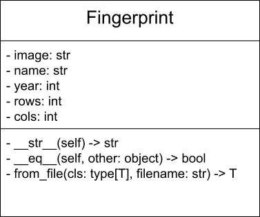

> [!CAUTION]
> This repository is for viewing only. Do not work on the assignment using this repository -- the actual course assignments will be provided to you via Pawtograder.

# HW5: Biometric Fingerprint Processing

## Overview

This assignment is based on [this Nifty Assignment](http://nifty.stanford.edu/2024/servin-alonso-garcia-fingerprint/).

Welcome to the Biometric Fingerprint Processing assignment! In this project, you will store and use biometric fingerprint information for authentication. You'll implement a fingerprint processing system that can read, store, display, and compare fingerprint data.

### Learning Objectives

- Reading and processing data from files
- Working with 2D lists in Python
- Implementing a class following a UML diagram
- Overwriting `__eq__()`
- Creating custom exceptions
- Using `@classmethod` to write alternative constructors
- Using a class variable
- Adding properties to a class
- Building an incident response system for authentication

## Assignment Parts

### Data
Fingerprint text files are in the `data` folder.
- `Original.txt` is the main user's fingerprint.
- `User1.txt`, `User2.txt`, etc. are fingerprints of different users (other than oringinal).
- `variation1.txt`, `variation2.txt` and so on are variations of `Original.txt`, to be used for testing within an error threshold.

The first four lines of each fingerprint text file contain:
1. the user's name
2. the year that the fingerprint was recorded
3. the number of rows of data
4. the number of columns of data
The lines after that are the pixels of the fingerprint image. Each character is a pixel.

The reason we need to store the number of rows and columns (rather than calculating them from the length of the data) is so that we can ignore the whitespace (spaces, tabs, and newline characters) in the data. The whitespace is not always exactly correct.

### Part 1: The `Fingerprint` class in `fingerprint.py`

#### `Fingerprint` UML Diagram:

- Give the `Fingerprint` class a class variable called `match_threshold`, which represents the threshold for considering a fingerprint match successful. It should have a default value of 0.9.
- `Fingerprint`'s constructor should take and store the data, name, year, number of rows, and number of columns. Make sure to store a copy of the data, rather than an alias of the data.
- Add an "alternative constructor" for the `Fingerprint` class (using `@classmethod`) called `from_file`, which takes a file name and creates a `Fingerprint` using the data in the provided file. Make sure the alternative constructor will work for any subclasses of `Fingerprint`.
- Implement the properties `image`, `rows`, `cols`, `name`, and `year`
- Overwrite the `__str__()` method to return a string of the format: `"Fingerprint for: Mini. Year recorded: 2025"` (the name and year will be replaced)
- Overwrite the `__eq__()` method to:
  - Return `False` if `other` is not a `Fingerprint`
  - Return `False` if `other` has a different number of rows and columns
  - Return `True` if the percentage of pixels which are equal between the two `Fingerprint`s is at least `match_threshold`

Don't forget to write tests in `test_fingerprint.py`!

### Part 2: The `Login` class in `login.py`
- Above the `Login` class, create a class called `MaxTriesExceededError` which is a custom error.
- The `Login` constructor should take and store the original user's fingerprint, and the setting for the number of tries that a user can attempt and fail before being locked out. It should also create a private attribute (two underscores) for the number of failed attempts that a user has made so far.
- `Login`'s `authenticate()` method should take a `Fingerprint` and:
  - if the number of attempts made by the user until now is at least the maximum number of tries allowed, raise a `MaxTriesExceededError`
  - set `Fingerprint`'s `match_threshold` to the provided `match_threshold` argument provided to the `authenticate()` method
  - if the provided `Fingerprint` is equal to the `original Fingerprint` (within the threshold), reset the number of failed attempts to 0 and return `True`
  - otherwise, increment the number of failed attempts, print `"Authentication failed"`, possibly raise a `MaxTriesExceededError` (if the number of attempts made is now at least the maximum number of attempts allowed), and return `False`

Don't forget to write tests in `test_login.py`!

### Summary.md
Please answer the questions in `Summary.md`.